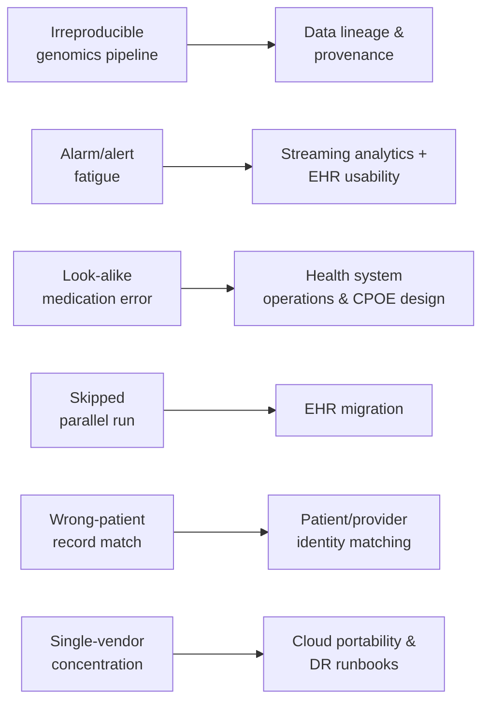

# Failure-mode case studies

> _Last reviewed: 2026-07-08 — see the [freshness policy](../appendix/maintenance.md)._

## Learning objectives

After this chapter you will be able to:

- Trace six real, documented HLS/health-IT failures to an architectural root cause, not just "human error."
- Name the specific pattern from earlier in this book that would have prevented or contained each one.
- Apply the same "what pattern would have caught this" analysis to a failure you encounter on your own projects.

## Why real failures, not hypotheticals

Every pattern in this book — parallel-run testing, alert tuning, patient matching, data
provenance, vendor-concentration risk — exists because something concrete broke without it. This
chapter is six real, publicly documented incidents, each mapped to the specific chapter and
pattern that addresses its root cause. Read it as a companion to the [security review](./02-security-review.md)
and [capstone exemplar](./04-capstone-exemplar.md): the same "what could go wrong and what
controls it" thinking, grounded in cases that actually happened.

## 1. The Duke "Potti scandal" — irreproducible genomics without provenance (2006–2015)

**What happened.** A Duke University research group published genomic signatures claiming to
predict which chemotherapy regimen would work best for an individual cancer patient, and enrolled
patients in clinical trials based on the predictions. Biostatisticians Keith Baggerly and Kevin
Coombes, attempting to reproduce the results, found the underlying analysis riddled with basic
data-handling errors — samples mislabeled, off-by-one indexing errors — that were undetectable
without being able to trace every number back to its source. The trials were eventually halted,
papers retracted, and the case became a landmark study in genomics research integrity, prompting a
2012 Institute of Medicine report on validating omics-based tests before clinical use.

**Root cause.** Not fraud alone — an **absence of traceable provenance**. Nobody outside the
original team could reconstruct which sample produced which result, because the pipeline had no
enforced chain of custody from raw data to published conclusion.

**What would have caught it.** [Data lineage & provenance](../05-data-platforms/07-data-lineage-provenance.md)'s
core discipline — an immutable bronze layer and emission points designed into every pipeline stage
— plus the [OHDSI negative-control/empirical-calibration](../05-data-platforms/06-ohdsi-study-package.md)
practice of validating a method against known-null outcomes before trusting its results, and the
[regulated AI artifact](../06-ai-ml/07-regulated-ai-artifacts.md) discipline of freezing a
validation plan before unblinding.

## 2. The Joint Commission's alarm-fatigue Sentinel Event Alert (2013) → National Patient Safety Goal (2014)

**What happened.** The Joint Commission's 2013 Sentinel Event Alert documented multiple US
patient deaths linked to unheeded, silenced, or misconfigured physiologic monitor alarms —
clinicians desensitized by a high volume of non-actionable alerts missed the ones that mattered.
This body of evidence led directly to alarm management becoming a **National Patient Safety Goal**
in 2014, a rare case of a documented failure pattern reshaping US hospital accreditation
requirements.

**Root cause.** Alert volume and specificity were never treated as a primary design metric —
alarms were tuned for sensitivity (catch everything) with no corresponding investment in reducing
false positives, training clinicians to tune out the entire channel.

**What would have caught it.** [Real-time streaming clinical analytics](../08-integration/04-realtime-streaming-analytics.md)'s
treatment of false-alarm rate as the dominant NFR (not a secondary metric), the
[LIS critical-value](../08-integration/05-lis-architecture.md) positive-acknowledgment workflow
design, and [EHR usability & documentation burden](../08-integration/07-ehr-usability-documentation-burden.md)'s
guidance to tier alert severity and suppress non-actionable alerts.

## 3. The Quaid twins' heparin overdose (Cedars-Sinai, 2007)

**What happened.** Newborn twins were accidentally administered adult-strength heparin (a blood
thinner) at roughly 1,000 times the intended pediatric dose, after nurses drew from look-alike
vials distinguished only by concentration printed in small text on similar packaging — the same
error that had already caused infant deaths at other hospitals. The case became widely publicized
and is now a standard teaching case in medication-safety and health-IT curricula for the design of
**barcode medication administration (BCMA)** and CPOE hard-stops.

**Root cause.** The system relied on a human correctly reading small print under time pressure,
with no independent, automated check between "drug in hand" and "drug administered."

**What would have caught it.** The [health system operations](../00-orientation/04-health-system-operations.md)
framing of clinical workflow as something a design must actively support, not assume goes right —
concretely, a barcode-verification hard stop at the point of administration cross-checking the
scanned medication against the order, the same "verify before it's irreversible" discipline
covered in the [LIS order-to-result lifecycle](../08-integration/05-lis-architecture.md)'s
instrument-verification step.

## 4. Skipped parallel-run testing during EHR migrations

**What happened.** As already noted in [EHR migration & data conversion](../08-integration/03-ehr-migration.md),
a JAMIA study found medication-dosage errors **doubled** during EHR transitions that skipped
adequate parallel testing — comparing the old and new systems side by side, live, before full
cutover. This is not one incident but a **documented pattern across many go-lives**, which is
precisely why it belongs here: a failure mode common enough to be studied statistically, not just
recounted anecdotally.

**Root cause.** Treating parallel run as a scheduling nicety that can be compressed under deadline
pressure, rather than the patient-safety control the data shows it to be.

**What would have caught it.** [EHR migration & data conversion](../08-integration/03-ehr-migration.md)'s
explicit guidance to budget at least two full test migrations and make the parallel-run comparison
**automatic**, not manual spot-checks.

## 5. Wrong-patient record matching across unaffiliated systems

**What happened.** Patient-safety organizations, including ECRI Institute's Partnership for Health
IT Patient Safety, have published aggregated findings on patient-identification errors — orders
placed on, or records merged with, the wrong patient — as a recurring, systemic category of harm
in health IT, distinct from any single publicized incident. The risk grows sharply whenever
matching crosses organizational boundaries with no shared identifier space, exactly the situation
an [HIE](../08-integration/06-hie-architecture.md) or nationwide exchange creates by design.

**Root cause.** Probabilistic patient matching across systems that were never designed to share an
identity space, without enough corroborating identifiers or human review at the point a match
result gets acted on.

**What would have caught it.** The deterministic/probabilistic/hybrid matching discipline in
[Patient & provider identity matching](../02-interoperability/13-patient-provider-identity.md),
and the explicit warning in [HIE architecture](../08-integration/06-hie-architecture.md) that a
federated Record Locator Service's match rates are inherently lower — and the stakes of a false
match higher — than an internal MPI's.

## 6. The CrowdStrike outage and hospital operations (July 19, 2024)

**What happened.** A faulty content update to CrowdStrike's Falcon endpoint-security sensor caused
a mass crash of Windows systems worldwide. The disruption reached far beyond IT departments:
multiple US health systems reported delayed surgeries, diverted ambulances, and disrupted EHR
access, because the same vendor dependency sat underneath clinical infrastructure at hospitals that
had no operational relationship with each other beyond sharing that one vendor.

**Root cause.** Concentrated dependency on a single vendor/component with no isolation or fallback
path, at a scale where "our vendor's outage" became "every hospital using that vendor's outage" on
the same day.

**What would have caught it.** [Cloud portability & avoiding lock-in](../04-cloud-platforms/08-portability-lock-in.md)'s
case for designing against single-vendor concentration, and a tested [DR runbook](../10-sa-craft/02-security-review.md)
with a real, exercised fallback path — not just a documented RTO/RPO nobody has actually rehearsed
failing over to.

## Design guidance

1. **Read failures as architecture problems, not people problems.** Every case here has a named
   human action at its center and a systemic, designable cause behind it — design for the second,
   not the first.
2. **A pattern documented once in this book is a control; a pattern violated once in the field is
   an incident.** Treat the two as the same fact viewed from different sides.
3. **Statistically documented patterns (case 4) deserve the same weight as single dramatic
   incidents (case 3)** — a study showing a doubled error rate is exactly as actionable as a
   headline, and easier to budget against.
4. **Concentration risk (case 6) is invisible until it isn't** — ask "what single vendor/component,
   if it failed today, takes down clinical operations across unrelated organizations at once?"
5. **Run this same analysis on your own project's near-misses.** The value of this chapter is the
   method, not just the six examples in it.

## Check yourself

1. For each of the six cases, name the one architectural control (not a training or policy fix)
   that most directly addresses its root cause.
2. Why is the JAMIA parallel-run finding (case 4) arguably more useful to an SA than a single
   dramatic incident, even though it's less memorable as a story?
3. Pick a failure from your own experience or reading and apply the same three-part structure —
   what happened, root cause, which pattern would have caught it.

## Further reading

- [Baggerly & Coombes — "Deriving chemosensitivity from cell lines: Forensic bioinformatics"](https://projecteuclid.org/journals/annals-of-applied-statistics/volume-3/issue-4/Deriving-chemosensitivity-from-cell-lines--Forensic-bioinformatics-and-reproducible/10.1214/09-AOAS291.full) (2009)
- [The Joint Commission — Sentinel Event Alert 50: Medical device alarm safety](https://www.jointcommission.org/resources/sentinel-event/sentinel-event-alert-newsletters/sentinel-event-alert-issue-50-medical-device-alarm-safety-in-hospitals/)
- [ECRI Institute — Partnership for Health IT Patient Safety](https://www.ecri.org/partnership-for-health-it-patient-safety)
- [EHR migration & data conversion](../08-integration/03-ehr-migration.md) · [Data lineage & provenance](../05-data-platforms/07-data-lineage-provenance.md)
