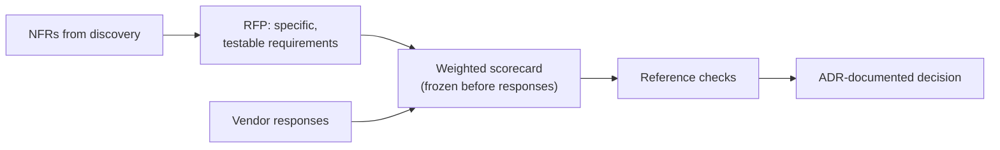

# Vendor & RFP evaluation framework

> _Last reviewed: 2026-07-09 — see the [freshness policy](../appendix/maintenance.md)._

## Learning objectives

After this chapter you will be able to:

- Write RFP requirements specific enough that a vendor can't satisfy them with marketing copy.
- Score vendors on a weighted framework frozen before responses arrive, instead of rationalizing a decision after the fact.
- Document a defensible, ADR-style vendor decision that survives the question "why did we pick them?" a year later.

## The recurring SA activity this book hasn't covered yet

[Discovery & requirements](./00-discovery-requirements.md) covers gathering NFRs, and
[Trade-offs, TCO & cost](../01-foundations/03-tradeoffs-tco.md) covers reasoning about build-vs-buy
economics. What's missing is the activity that sits between them and shows up constantly in real
SA work: **choosing a vendor** — an EHR module, a FHIR platform, an imaging AI product, a managed
cloud service — through a structured evaluation rather than an ad hoc bake-off decided by whoever
demoed best.

## Writing an RFP that surfaces real differentiators

The most common RFP failure is writing requirements every vendor can trivially satisfy — "supports
interoperability standards" gets a "yes" from everyone and tells you nothing. Write requirements
specific enough to actually differentiate:

1. **Functional requirements tied to your actual NFRs**, not generic capability claims. Not "does
   it support FHIR" — "does it support US Core vX with these specific must-support elements,
   validated how?" (see [FHIR profiles & regulation](../02-interoperability/06-fhir-profiles-us-ca.md)
   for what "supports FHIR" actually needs to mean).
2. **Deployment and architecture model** — multi-tenant vs. single-tenant, data residency options,
   and HIPAA/HITRUST posture. Ask for the specific claim, not the marketing summary.
3. **Integration surface** — which APIs and standards are actually implemented, at what
   conformance level, with what SMART on FHIR scopes and Bulk Data support.
4. **Compliance evidence, not compliance claims.** Ask for the actual section of the vendor's
   HITRUST/SOC 2 report that covers the control you care about — the same citation discipline as
   [inherited controls](../03-compliance/08-hitrust-evidence-lab.md) in a HITRUST assessment.
   "We are HIPAA compliant" is not evidence; a report section is.
5. **Total cost of ownership mapped to your actual volume.** Request the pricing model's structure
   (per-transaction, per-user, data-volume tiers) and run it against your **projected** volume, not
   list price — see [Trade-offs, TCO & cost](../01-foundations/03-tradeoffs-tco.md).
6. **Roadmap and viability.** A vendor not yet conformant to the USCDI version or FHIR release your
   mandate requires is a real, quantifiable risk, not a footnote.
7. **Live references in your segment**, not generic case studies — ask for customers you can
   actually call.

## The scorecard: freeze the weights before you see responses

Define a weighted scorecard **before** vendor responses arrive — functional fit, compliance
evidence, integration effort, TCO, vendor viability — and score each vendor 1–5 per criterion. This
is the same discipline as [freezing a validation plan before unblinding results](../06-ai-ml/07-regulated-ai-artifacts.md):
a scorecard built or reweighted *after* seeing responses isn't evaluation, it's post-hoc
justification for a decision already made informally. Require the losing bidders' specific gaps to
be documented — this is what makes the process defensible, especially in regulated or public
procurement contexts where "why not vendor B" needs a real answer.

## Common RFP failure modes

- **Requirements written from marketing copy** that every vendor can trivially satisfy — fix by
  writing testable requirements per the list above.
- **Skipping reference calls** because the written responses looked strong — a written response is
  the vendor's best case; a reference call is closer to the truth.
- **TCO based on list price** instead of your actual usage pattern — vendors' published pricing
  rarely maps cleanly onto your specific volume and growth curve.
- **No documented decision rationale** — without an ADR-style record, "why did we pick them"
  becomes an unanswerable question the moment the person who ran the RFP leaves.

## Design guidance

1. **Write requirements a vendor can fail**, not ones every vendor trivially passes.
2. **Request evidence, not claims** — a compliance report section, not a compliance assertion.
3. **Freeze the scorecard weights before responses arrive**, and don't reweight after seeing them.
4. **Always reference-check** — a written RFP response is the vendor's best case, not the typical
   case.
5. **Document the decision as an ADR** (see [C4 diagrams & ADRs](../01-foundations/02-c4-and-adrs.md))
   — context, options considered, decision, and consequences — so the rationale survives staff
   turnover.

## Check yourself

1. Why does asking a vendor for "the specific section of your HITRUST report covering encryption
   at rest" produce better evidence than asking "are you HIPAA compliant?"
2. Why should the scorecard's weights be frozen before vendor responses arrive, rather than
   adjusted afterward to fit the response that looked strongest?
3. A year after a vendor decision, a new team member asks "why didn't we pick the cheaper option?"
   What artifact should already answer that question, and why is it produced during the RFP
   process rather than after?

## Further reading

- [Discovery & requirements](./00-discovery-requirements.md) · [Trade-offs, TCO & cost](../01-foundations/03-tradeoffs-tco.md)
- [C4 diagrams & ADRs](../01-foundations/02-c4-and-adrs.md) · [HITRUST evidence pack lab](../03-compliance/08-hitrust-evidence-lab.md)
- [KLAS Research — healthcare IT vendor performance data](https://klasresearch.com/)
