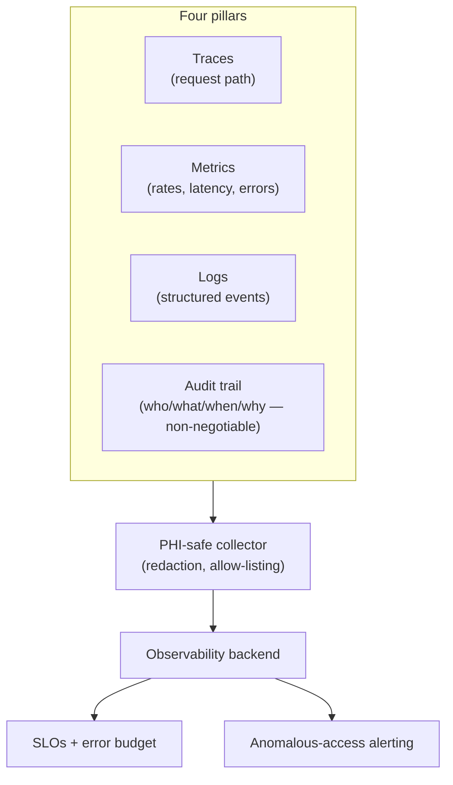

# Observability for clinical platforms

> _Last reviewed: 2026-08-03 — see the [freshness policy](../appendix/maintenance.md)._

## Learning objectives

After this chapter you will be able to:

- Design a PHI-safe telemetry pipeline covering traces, metrics, logs, and the audit trail.
- Set SLOs and error budgets calibrated to which paths are life-safety-adjacent versus administrative.
- Treat the audit log as a first-class observability signal you can alert on, not just a forensic record.

## The gap between a logging line and an operable platform

[Security review](./02-security-review.md)'s checklist names "logging hygiene — no PHI in
application logs" and "incident response" as line items; [regulated AI artifacts](../06-ai-ml/07-regulated-ai-artifacts.md)
and the [GenAI app stack](../06-ai-ml/10-genai-app-stack.md) chapter's observability section cover
tracing for one system type. This chapter is the general architecture underneath all of that: how
an HLS platform is actually instrumented so it's debuggable, alertable, and auditable — for any
service, not just an AI feature.

## Four pillars, not three

Standard observability practice names three pillars — traces, metrics, logs. HLS needs a fourth,
and it isn't optional the way the others can be tuned down under cost pressure:

- **Traces** — the path a single request took across services (a FHIR gateway → converter → NLP
  service → lakehouse write), so a slow or failed request is debuggable end to end.
- **Metrics** — aggregate rates: request volume, latency percentiles, error rates — what you alert
  and page on.
- **Logs** — structured, discrete events for the detail traces and metrics can't carry.
- **Audit trail** — who accessed which PHI, when, and for what purpose. [HIPAA](../03-compliance/00-hipaa.md),
  [HITRUST](../03-compliance/01-hitrust.md), and [GxP](../03-compliance/02-gxp-part11.md) all
  require it, and unlike the other three pillars, **you cannot sample or discard it** under volume
  or cost pressure — a sampled trace is a reasonable trade-off; a sampled audit trail is a
  compliance gap.

## OpenTelemetry as the instrumentation standard

**OpenTelemetry** is the vendor-neutral SDK/API for traces, metrics, and logs — instrument once,
export to any backend. That portability matters for the same reason it matters everywhere else in
this book: you can change observability vendors without re-instrumenting every service, the
telemetry equivalent of the [cloud portability](../04-cloud-platforms/08-portability-lock-in.md)
principle. **W3C Trace Context** propagation is what makes a single patient-facing request traceable
across service boundaries — every hop passes the same trace ID forward, so a slow FHIR read that
touches four services shows up as one connected trace, not four disconnected log lines someone has
to correlate by hand.

## PHI-safe telemetry: the central HLS constraint

Telemetry is exactly the kind of channel where PHI leaks by accident, not by design — a trace span
attribute that includes a patient name pulled from a URL, a debug log line that dumps a full FHIR
resource body. Design rules, not guidelines:

- **Never put PHI in span attributes or log messages by default.** Log the resource *type* and
  *reference* (`Patient/123`), never the resource body — the same "reference, not payload"
  discipline already established for [event payloads](../08-integration/01-event-driven.md).
- **Use structured logging with an explicit allow-list of safe fields**, not a deny-list of fields
  to scrub. An allow-list fails closed (an unknown field is dropped); a deny-list fails open (an
  unknown field ships by default) — and a new field always arrives before anyone remembers to
  update the deny-list.
- **Redact at the collector as a backstop, not as the only control.** Application-level discipline
  will eventually miss a case; a collector-level redaction rule (scanning for identifier patterns
  before export) catches what call-site discipline doesn't.
- **Treat the observability backend itself as PHI-adjacent.** If any identifier leaks through, the
  backend needs the same [HIPAA-eligible, BAA-covered](../03-compliance/00-hipaa.md) posture as any
  other system touching PHI — "it's just logs" is not an exemption.

## SLOs calibrated to clinical stakes, not applied uniformly

Borrow SRE's SLI/SLO/error-budget vocabulary, but don't apply one bar everywhere:

- **Life-safety-adjacent paths** — a FHIR read backing a real-time clinical alert (see
  [real-time streaming clinical analytics](../08-integration/04-realtime-streaming-analytics.md)) —
  need aggressive latency/availability SLOs and paging on breach.
- **Administrative paths** — a nightly Bulk Data export, a reporting query — tolerate a much
  looser SLO; paging on every blip here trains the on-call rotation to ignore pages, which is the
  **ops-team version of alert fatigue**, the identical failure mode
  [EHR usability & documentation burden](../08-integration/07-ehr-usability-documentation-burden.md)
  and the [Joint Commission case study](./05-failure-mode-case-studies.md) describe for clinicians.
- **Error budgets** are the practical governance device: when a service's budget is exhausted,
  feature work pauses for reliability work. This is a cross-team agreement, not just a dashboard
  number — write it down before the first budget burn, not during one.

## The audit log as a first-class observability signal

HIPAA/HITRUST/GxP audit-trail requirements are usually framed as a compliance artifact you produce
and file away. Treat it instead as a **live observability signal**: "who accessed which PHI, when,
for what purpose" is exactly the shape of data that supports anomaly detection — a user account
suddenly reading records for patients outside their care panel, a service account's access pattern
changing after a deploy. Wire audit events into the same alerting path as your other signals rather
than treating the audit trail as something you only consult forensically, after an incident is
already confirmed. This is the same "assess once, report many" idea from
[HITRUST](../03-compliance/01-hitrust.md) — one signal, serving both compliance evidence and
security operations.

## Design guidance

1. **Instrument with OpenTelemetry from day one** — retrofitting tracing into services that grew up
   without it is far more expensive than building it in.
2. **Allow-list telemetry fields; never deny-list.** Fail closed on unknown data.
3. **Calibrate SLOs per path, not platform-wide** — a uniform bar either pages too often on
   low-stakes paths or too rarely on life-safety-adjacent ones.
4. **Never sample the audit trail.** Traces and metrics can be sampled under volume; the audit log
   cannot.
5. **Feed audit events into live alerting**, not only into a compliance archive — anomalous access
   is a security signal available in real time, not just after the fact.

## Check yourself

1. Why does HLS observability need a fourth pillar beyond traces/metrics/logs, and why can't that
   fourth pillar be sampled the way the others can under cost pressure?
2. Why does an allow-list of safe telemetry fields fail more safely than a deny-list of PHI fields
   to scrub?
3. A platform pages on-call for every latency blip on a nightly batch export. What failure mode
   does this risk, and what's the fix?

## Further reading

- [OpenTelemetry](https://opentelemetry.io/) · [W3C Trace Context](https://www.w3.org/TR/trace-context/)
- [Google SRE Book — Service Level Objectives](https://sre.google/sre-book/service-level-objectives/)
- [Security review](./02-security-review.md) · [HITRUST evidence pack lab](../03-compliance/08-hitrust-evidence-lab.md)
